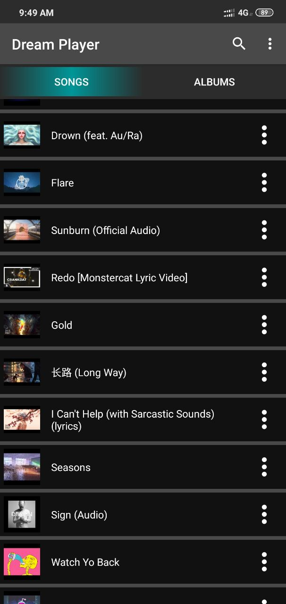
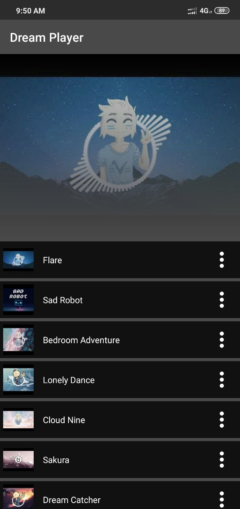
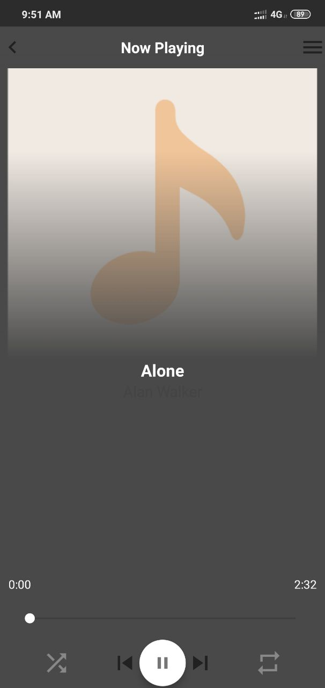
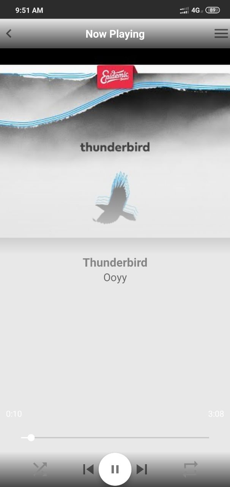
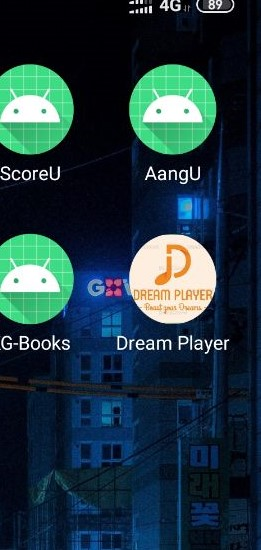
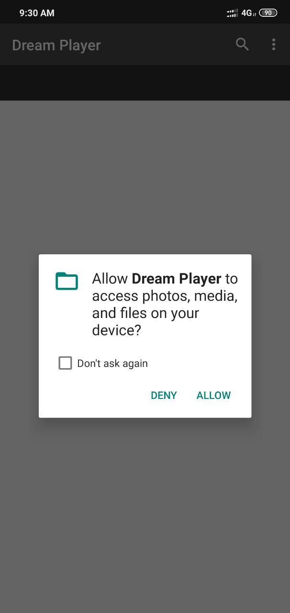
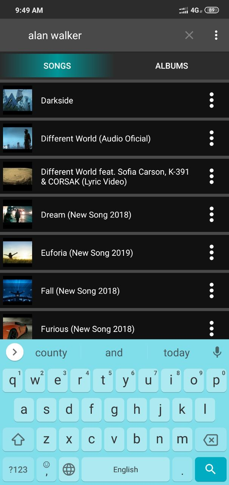
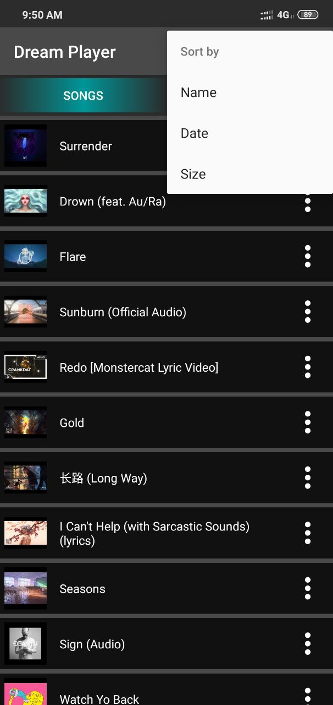
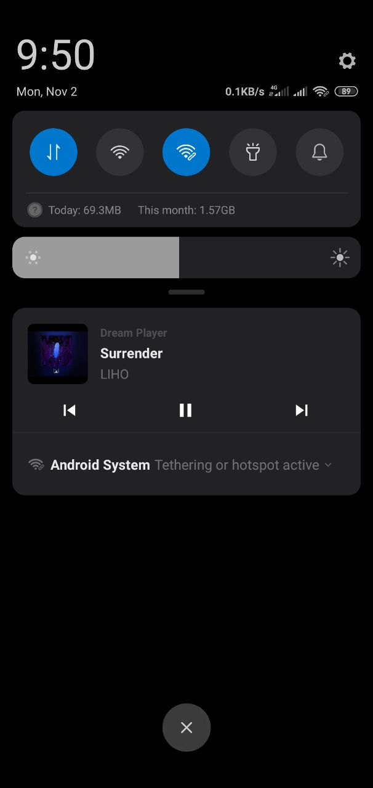
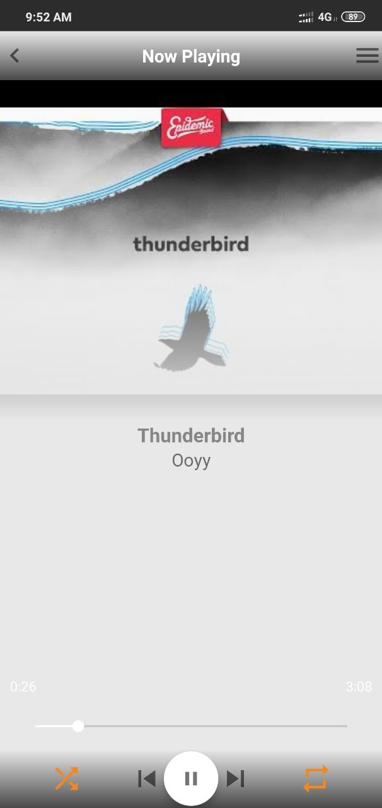

## Midterm Project requirements
* Link to a repository (20 pts max) ✅
  * your code (5 pts) ✅
  * [apk](releases/Dream%20Player%20-%201.0.0.apk) in releases (5 pts) ✅
  * name and short description (5 pts) ✅
  * screenshots in readme.md (5 pts) ✅
* Use of data storage (SharedPreferences, sqlite, room) (20 pts max) ✅ Used SharedPreferences in MainActivity for sorting. Used SharedStorage for Audio Files
* RecycleView or Cardview with custom layout and code (20 pts max) ✅ All [three adapters](app/src/main/java/com/example/dreamplayer/adapter) are RecyclerView
* At least one activity should be written on Kotlin (20 pts max) ✅ 100% kotlin
* Misc:
  * Application icon changed  - 10 pts max ✅
  * Animation and design (figma or other) - 10 pts max - use material kit ✅[Figma Design](https://www.figma.com/file/Dzu0dTdNDn2O7xfExjS8C6/Main?node-id=0%3A1); [Figma Present](https://www.figma.com/proto/Dzu0dTdNDn2O7xfExjS8C6/Main?node-id=2%3A0&scaling=scale-down)
* Bonus points for retrofit calls and Unit testing (10 pts max each) ❌

## Screenshots of UI
<table>
  <tr>
    <td>App starts with songs list</td>
     <td>And on the second tab albums list</td>
  </tr>
  <tr>
    <td></td>
    <td></td>
  </tr>
 </table>

<table>
 <tr>
  <td>After clicking on a Album it will display list of songs in this album</td>
 </tr>
 <tr>
  <td></td>
 </tr>
</table>

<table><tr><td>After clicking on a song it will display player and start to play, UI colors will change according to song's art's color</td></tr></table>
<table>
 <tr>
  <td></td>
  <td></td>
  <td></td>
  <td></td>
 </tr>
</table>
 
 ## Screenshots of misc capabilities
 
<table>
 <tr>
  <td> App icon </td>
  <td> Logo </td>
  <td> Asking for permission </td>
 </tr>
 <tr>
  <td></td>
  <td></td>
  <td></td>
 </tr>
</table>

<table>
 <tr>
  <td> Searching songs</td>
  <td> Sorting songs list</td>
  <td> Notification </td>
 </tr>
 <tr>
  <td></td>
  <td></td>
  <td></td>
 </tr>
</table>

<table>
 <tr>
  <td> Default art of songs </td>
  <td> Shuffle and repeat off</td>
  <td> Shuffle and repeat on</td>
 </tr>
 <tr>
  <td></td>
  <td></td>
  <td></td>
 </tr>
</table>
